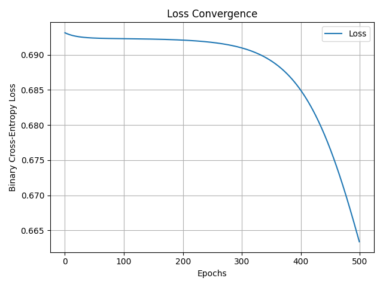

# Neural Network from Scratch

Build a fully functional neural network **from scratch** using only NumPy.  
This project demonstrates forward pass, backpropagation, training, and visualization of loss convergence and decision boundaries.

---

## Abstract

This project implements a neural network **from scratch**:

- Forward pass and backpropagation without high-level libraries  
- Training on a simple classification dataset  
- Visualization of **loss convergence**, **training dynamics**, and **decision boundaries**  
- GIFs and plots to illustrate network learning

This emphasizes **understanding neural network fundamentals**, not just using libraries.

---

## Why This Project

- Demonstrates a **deep understanding of neural networks**  
- Shows ability to **build, not just consume** AI tools  
- Provides **clear visualizations** of learning and convergence  
- Prepares a **professional, competitive GitHub portfolio**  

---

## Requirements

- Python 3.11+  
- NumPy  
- Matplotlib  

---

## Phase 0: Dataset Preparation and Parameter Initialization

**Scientific Question:** How do we prepare data and initialize network parameters?  

**Implementation:**  
- Generate or load dataset  
- Initialize weights and biases  
- Save parameters to `parameters.npy`  

**Code:** `code/setup_dataset.py`  
**Output:** `data/parameters.npy`  

**Purpose:** Prepare dataset and network for training.

---

## Phase 1: Forward Pass

**Scientific Question:** How does input propagate through the network?  

**Implementation:** Compute network output using initial weights  

**Code:** `code/forward_pass.py`  

**Example Output:**
Forward pass output:
[[0.50000401]
[0.49999837]
[0.49998104]
[0.5 ]]

**Purpose:** Demonstrates input transformation through layers.

---

## Phase 2: Backpropagation

**Scientific Question:** How are gradients computed and weights updated?  

**Implementation:**  
- Compute gradients of loss w.r.t. weights  
- Update weights using learning rate  
- Save updated weights  

**Code:** `code/backprop.py`  

**Example Output:**
Loss before backprop: 0.6931538403054052
Loss after one backprop step: 0.6931522900226582

Loss before backprop: 0.6931538403054052
Loss after one backprop step: 0.6931522900226582

**Purpose:** Demonstrates gradient computation and weight updates.

---

## Phase 3: Training Loop

**Scientific Question:** How does the network learn over multiple epochs?  

**Implementation:**  
- Train over multiple epochs  
- Save loss per epoch  
- Update weights each epoch  

**Code:** `code/training_loop.py`  
**Output:** Updated weights in `data/parameters.npy`  

**Purpose:** Shows full training with tracked loss for visualization.

---

## Phase 4: Training Dynamics

**Scientific Question:** How does the network improve over time, and how do predictions evolve?

**Implementation:**  
- Track **loss per epoch** → **Loss Curve**  
- Generate **Graph** for a key metric / prediction distribution  
- Capture **snapshot images at key epochs** (0, 240, 499)  
- Optional GIF for full epoch evolution  

---

### **Graph**

Shows a key metric or distribution of predictions during training:

**Purpose:** Visual representation of network behavior aside from loss.

---

### **Loss Curve**

Shows **overall loss trend across all epochs**:

**Purpose:** Demonstrates convergence and learning progression.

---

### **Snapshot Images at Key Epochs**

Shows **network predictions at important stages of training**:

| Epoch 0 | Epoch 240 | Epoch 499 |
|---------|-----------|-----------|
|  |  |  |

**Explanation:**  
- **Epoch 0:** Network untrained → predictions random  
- **Epoch 240:** Network improving → predictions more accurate  
- **Epoch 499:** Network converged → stable predictions  

---

### **Optional GIF**

Visualizes **training progression across all epochs**:

**Purpose:** Clear visual demonstration of learning over time.

---

## Phase 5: Decision Boundary Visualization

**Scientific Question:** How does the network separate classes in feature space?  

**Implementation:**  
- Predict grid of points to generate decision regions  
- Overlay true dataset points  
- Snapshots at epochs: 0, 340, 499  
- Optional GIF for evolution  

**Key Epoch Snapshots:**  

| Epoch 0 | Epoch 340 | Epoch 499 | Final Predictions |
|---------|-----------|-----------|-----------------|
|  |  |  |  |

**Decision Boundary Evolution GIF:**  

**Purpose:** Demonstrates network learning to classify correctly over time.

---

## Phase 6: Optional Enhancements

- Combine **loss + decision boundary animations**  
- Test different **activation functions** (ReLU, Sigmoid, Tanh)  
- Experiment with **learning rates or network depth**  

**Purpose:** Show deeper understanding and experimentation.

---

## Conclusion

This project implements a **full neural network from scratch**, demonstrating:

1. Dataset preparation and weight initialization  
2. Forward pass computation  
3. Backpropagation and weight updates  
4. Training loop with tracked loss  
5. Phase 4: **Graph, Loss Curve, and Epoch Snapshots**  
6. Phase 5: Decision boundary visualization  

**Key Takeaways:**  
- Full understanding of **neural network fundamentals**  
- Clear visualization of training dynamics  
- Competitive, polished, university-ready presentation  
